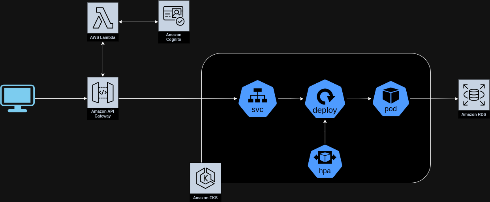

# lanchonete-lambda-infra
Repositório referente a infra-estrutura do API Gateway, Lambda Authorizer e Cognito utilizado no projeto da lanchonete do grupo 11.

## Arquitetura geral do projeto
[Video explicativo arquitetura]()


## Como configurar as credenciais da conta da AWS

Para configurar as credencias IAM localmente e  autenticar o Terraform na AWS, configure o arquivo ~/.aws/credentials com as credencias da conta AWS.

```
[default]
aws_access_key_id=XXXXXX
aws_secret_access_key=YYYYYY
aws_session_token=ZZZZZZ
```

## Como criar infra e o adicionar o primeiro usuário

1. Criar infra com o terraform
```
terraform init

terraform plan

terraform apply -auto-approve
```

2. Criar usuario adm - necessário aws cli e jq instalados
```sh
aws cognito-idp sign-up --client-id $(aws cognito-idp list-user-pool-clients --user-pool-id $(aws cognito-idp list-user-pools --max-results 1 | jq -r .UserPools[].Id) | jq -r .UserPoolClients[].ClientId) --username adm@lanchoneteg11.com --password adm12345 --user-attributes Name=name,Value=adm Name=email,Value=adm@lanchoneteg11.com
```

3. Confirmar usuário adm
```sh
aws cognito-idp admin-confirm-sign-up --user-pool-id $(aws cognito-idp list-user-pools --max-results 1 | jq -r .UserPools[].Id) --username adm@lanchoneteg11.com
```

4. Obter token
```sh
aws cognito-idp initiate-auth --client-id $(aws cognito-idp list-user-pool-clients --user-pool-id $(aws cognito-idp list-user-pools --max-results 1 | jq -r .UserPools[].Id) | jq -r .UserPoolClients[].ClientId) --auth-flow USER_PASSWORD_AUTH --auth-parameters USERNAME=adm@lanchoneteg11.com,PASSWORD=adm12345 --query 'AuthenticationResult.IdToken' --output text
```